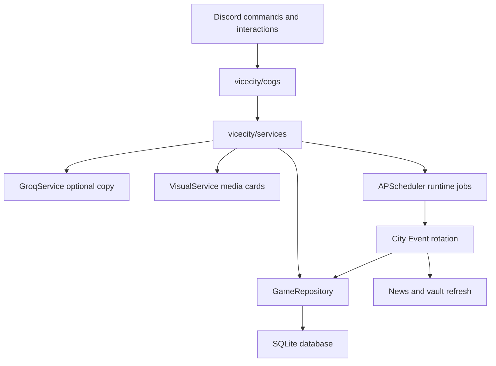

# Vice City OS - AI-Directed Discord Crime Sim

Vice City OS turns one Discord server into a live crime simulation where gangs earn cash, draw Heat, fight over turf, gamble, bribe City Hall, and react to citywide events.

The differentiator is the **City Event Director**: a live event system that rotates Vice City into states like Police Sweep, Black Market Sale, Casino Rush, and Harbor Shipment. Groq can write the bulletin copy, but every gameplay modifier is deterministic and falls back safely without an API key.

## Judge Demo Path

1. Seed a populated demo database:

   ```powershell
   py -3.11 tools/seed_demo.py --guild-id YOUR_GUILD_ID
   ```

   Expected output: four demo players, two gangs, turf ownership differences, populated news, and a live Harbor Shipment event.

2. Start the bot:

   ```powershell
   py -3.11 main.py
   ```

   Expected output: the bot connects, scheduler starts, runtime recovery runs, and `/status` reports the active guild target.

3. Check the live event:

   ```text
   /city event
   ```

   Expected output: a city event embed with the active effect and event banner.

4. Force a demo event:

   ```text
   /city event trigger police_sweep
   ```

   Expected output: Police Sweep becomes active, posts to news, refreshes the vault, and schedules the next rotation.

5. Run the affected gameplay paths:

   ```text
   /operate drug high
   /buy weapon
   /casino slots 100
   /casino flip 100 heads
   /news
   /status
   ```

   Expected output: operation success/payout/Heat, shop prices, casino payouts, news, and system status all reflect the current city state.

6. Disable `GROQ_API_KEY` and trigger another event.

   Expected output: the event still works with deterministic fallback copy, and `/status` reports the fallback reason.

## City Event Director

The City Event Director lives in `vicecity/services/city_events.py` and is wired into bot startup. On runtime recovery, the bot ensures a city event is active for the configured guild and schedules the next rotation.

Current event catalog:

| Event | Gameplay effect | Demo command |
| --- | --- | --- |
| Police Sweep | Operations lose 15 success chance and gain +1 extra Heat | `/city event trigger police_sweep` |
| Black Market Sale | Black market prices are 25 percent lower | `/city event trigger black_market_sale` |
| Casino Rush | Casino payouts are boosted by 50 percent | `/city event trigger casino_rush` |
| Harbor Shipment | Operation payouts are boosted by 40 percent | `/city event trigger harbor_shipment` |

Groq only writes copy for the headline, description, and broadcast. The modifiers are stored as structured JSON in SQLite and applied by service methods, so the economy math stays bounded and testable.

## What Is Implemented

### Core Game

- Hybrid commands (`/` and `!`) for key gameplay
- Player join/profile/wallet/gang flows
- Gang banks, tax, treasury, and mayor controls
- Turf ownership, hourly income, wars, and war recovery
- Heat, jail, wanted board, pardons, lawyers, and cooldowns
- Drug operations, arms deals, casino games, and casino heists
- Daily streak rewards through `/daily`

### Cinematic UX

- Profile ID cards
- Heat 5 wanted posters
- Heist result cards
- Animated event banners
- Quick-action buttons, selects, and modal negotiation flow
- Live news feed and persistent vault/wanted channels

### Groq Scope

Groq is optional and used for bounded flavor text:

1. Bust negotiation scenes after failed operations
2. Heist live narration and recap
3. Street informant tips from real game state
4. City event headline, description, and broadcast copy

If Groq is unavailable, every feature uses deterministic fallback output.

## Commands

| Command | Purpose |
| --- | --- |
| `/join` | Join Vice City and receive a gang assignment |
| `/profile [member]` | Show a player profile card |
| `/wallet` | Show wallet, Heat, rank, and daily status |
| `/daily` | Claim the daily streak reward |
| `/gang` | Show gang overview |
| `/gang deposit <amount>` | Move wallet cash into gang bank |
| `/gang withdraw <amount>` | Withdraw from gang bank as Capo/Boss |
| `/map` | Show turf control |
| `/news` | Show latest city news with live event pinned |
| `/wanted` | Show wanted board and Heat 5 poster |
| `/leaderboard` | Show richest players, strongest gangs, and hottest movers |
| `/pay <member> <amount>` | Transfer wallet cash |
| `/shop` | Open black market UI |
| `/buy <item>` | Buy weapon, burnerphone, or lawyer |
| `/tip` | Ask the AI street informant for a state-based hint |
| `/operate` | Open operation selector |
| `/operate drug <risk>` | Run a low/medium/high drug operation |
| `/operate arms <teammate>` | Start a two-player arms deal |
| `/attack <turf>` | Start a turf war |
| `/assault` | Commit to the attacking side |
| `/defend` | Commit to the defending side |
| `/mayor tax <0-20>` | Set city tax rate |
| `/mayor crackdown <hours>` | Increase operation Heat pressure |
| `/mayor pardon <member>` | Release a jailed member |
| `/mayor reward <gang> <amount>` | Send treasury funds to a gang |
| `/bribe mayor <amount>` | Offer a bribe |
| `/city sync` | Mayor-only setup/runtime refresh |
| `/city event` | Public live city event view |
| `/city event trigger <event_key>` | Admin-only demo event trigger |
| `/heist` | Show heist help |
| `/heist plan [casino]` | Start a casino heist |
| `/heist join <hacker|driver|inside>` | Join a heist role |
| `/heist go` | Launch the ready heist |
| `/casino` | Show casino options |
| `/casino slots <amount>` | Play slots |
| `/casino flip <amount> <heads|tails>` | Flip against the house |
| `/casino duel <member> <amount>` | Challenge another player |
| `/casino blackjack <amount>` | Play blackjack |
| `/rat <member> <reason>` | Report another player |
| `/vote exile <member>` | Start a gang exile vote |
| `/challenge boss` | Challenge for gang leadership |
| `/status` | Show uptime, scheduler, Groq status, guild target, and current event |
| `/help` | Interactive help |
| `/guide` | Player onboarding guide |

## Architecture



Key files:

- `vicecity/bot.py`: boot, services, scheduler, command sync, runtime recovery
- `vicecity/repositories/game_repository.py`: SQLite tables and transactional persistence
- `vicecity/services/city_events.py`: event catalog, Groq fallback copy, effect helpers, rotation
- `vicecity/services/operations.py`: operation success, payout, and Heat integration
- `vicecity/services/city.py`: shop pricing, news, vault, profiles, daily rewards
- `vicecity/services/casino.py`: casino payout integration
- `vicecity/cogs/mayor.py`: `/city event` and admin trigger command
- `vicecity/cogs/status.py`: demo confidence health check
- `tools/seed_demo.py`: standalone demo data seeder

## Screenshot And GIF Placeholders

Replace these after capture:

- `docs/profile-card.png`
- `docs/wanted-poster.png`
- `docs/heist-result.png`
- `docs/event-banner.gif`
- `docs/help-screen.png`
- `docs/demo-flow.gif`

Suggested capture order:

1. `/status`
2. `/city event`
3. `/city event trigger police_sweep`
4. `/operate drug high`
5. `/buy weapon` during Black Market Sale
6. `/casino slots 100` during Casino Rush
7. `/wanted` after Heat 5
8. `/heist go` and result card

## Setup

### Requirements

- Python 3.11
- Discord bot token
- A Discord server you control

Pinned dependencies:

- `discord.py==2.3.2`
- `aiosqlite==0.19.0`
- `APScheduler==3.10.4`
- `python-dotenv==1.0.0`
- `Pillow==12.2.0`

### Install

```powershell
py -3.11 -m pip install -r requirements.txt
```

### Configure `.env`

```env
DISCORD_TOKEN=your_bot_token_here
GUILD_ID=your_server_id_here
MAYOR_ROLE_NAME=Mayor
DATABASE_PATH=vicecity.db
TIMEZONE=Asia/Calcutta
LOG_LEVEL=INFO
GROQ_API_KEY=
GROQ_MODEL=groq-2.0-flash
```

`GROQ_API_KEY` is optional. If it is missing or a request fails, deterministic fallback copy is used.

### Run

```powershell
py -3.11 main.py
```

## Verification

Focused tests:

```powershell
py -3.11 -m pytest tests/test_city_events.py -v
```

Full suite:

```powershell
py -3.11 -m pytest tests/ -v
```

Manual checks:

- `/city event` displays active event and media.
- `/city event trigger police_sweep` forces Police Sweep.
- `/operate` under Police Sweep applies lower success and extra Heat.
- `/buy` under Black Market Sale debits discounted prices.
- `/casino slots` and `/casino flip` under Casino Rush credit boosted payouts.
- `/news` pins the active event.
- Vault channel includes the Live Event field.
- `/status` reports uptime, scheduler jobs, Groq fallback/request status, guild target, and city event.

## Deployment

This repo includes a Linux-friendly `Dockerfile`. It installs common fonts so profile cards, wanted posters, heist infographics, and event banners render cleanly.

```bash
docker build -t vice-city-os .
docker run --env-file .env vice-city-os
```

## Notes

- The bot is intentionally optimized for a single configured guild for demo reliability.
- Gameplay modifiers are deterministic and bounded.
- Visual generation gracefully degrades if Pillow cannot load.
- Groq is additive, never required for core gameplay.
